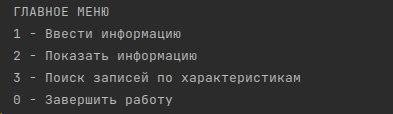
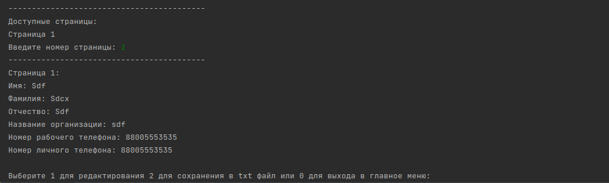

# Телефонный справочник со следующими возможностями:
1.                   Вывод постранично записей из справочника на экран
2.                   Добавление новой записи в справочник
3.                   Возможность редактирования записей в справочнике
4.                   Поиск записей по одной или нескольким характеристикам

в главном меню выберите одно из действий:

после добавления информации  добавиться страница с данными ее вы можете посмотреть перейдя из главного меню по цифре 2:

после выбора страницы вы можете редактировать информацию о текущей странице либо вывести информацию в txt файл:

также можно найти в справочнике контакты по номеру телефона личному/домашнему и названии организации
